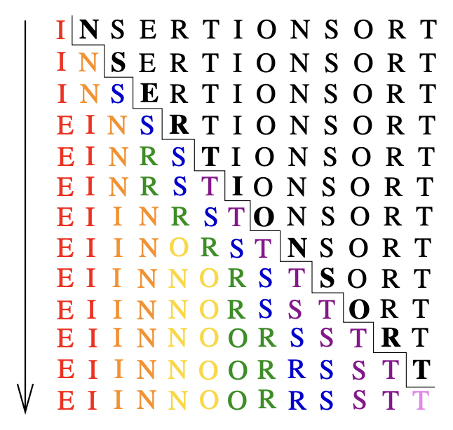

# Insertion Sort

A sorting algorithm that starts with a single element (thus trivially forming a sorted list) and then incrementally inserts the remaining elements so that the list remains sorted.

|  |
|:--:|
| *Insertion sort visualization* |

SOURCES:
* TADM - Skiena